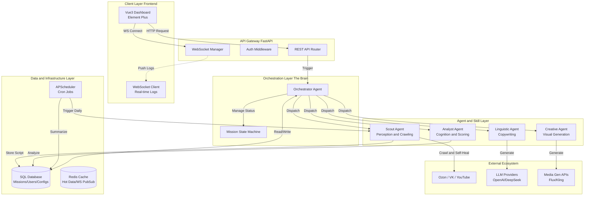

<div align="center">
  <h1>Ozon AI Assistant</h1>
  <h3>面向俄语电商场景的多 Agent 协作平台</h3>

  <p>
    <b>集成趋势采集、市场分析、文案生成与视觉创意，支持任务编排与实时日志推送</b>
  </p>

  <a href=""></a>
  <a href=""></a>
  <a href=""></a>
  <a href=""></a>
  <a href=""></a>
  <a href=""></a>
</div>

---

## 📺 演示视频 (Demo)


---

## 🏗️ 核心架构 (Architecture)

本项目采用 **Multi-Agent 协同架构**，实现了从 **数据感知 (Scout)** 到 **决策分析 (Analyst)** 再到 **创意生成 (Linguistic/Creative)** 的全流程闭环。系统核心由 **Orchestrator** 驱动，确保任务流转可控、可解释、可追溯。



### 📂 目录结构解析

```
backend/         FastAPI + SQLAlchemy + Agent 系统
frontend/        Vue3 + Vite + Element Plus
start_local.sh   一键启动脚本（Redis + 后端 + 前端）
ARCHITECTURE.md  架构说明与设计文档
```

---

## 🧠 4+1 协同模式与 OpenClaw 框架 (Under the Hood)

本项目基于 **OpenClaw** 开源框架构建，采用经典的 **"4+1" 智能体协同模式**。即 **1 个总控大脑 (Orchestrator)** 指挥 **4 个专业职能 Agent**，通过标准化协议进行高效协作。

### 🛡️ 核心：OpenClaw 框架

> OpenClaw 是专为电商出海场景设计的 Agent 编排框架，旨在解决跨平台数据割裂、多语言文化隔阂以及创意生产流程繁琐的问题。

其核心特性包括：
- **Mission State Machine**: 将复杂的业务流程封装为可观测、可回滚的状态机。
- **Self-Healing Crawlers**: 内置自愈能力的爬虫组件，自动应对反爬策略变化。
- **Logged LLM Gateway**: 统一的 LLM 接入层，支持多模型路由、成本核算与审计日志。
- **Real-time Feedback**: 基于 WebSocket 的全链路实时反馈机制。

---

### 🤖 Agent 职能详解 (The 4+1 Model)

#### 1. 🧠 Orchestrator Agent (总控大脑)
**"指挥官"** — 负责意图理解、任务拆解与全局调度。
- **意图解析**: 将用户模糊的自然语言指令（如"帮我看看最近Ozon上什么猫粮好卖"）转化为结构化的 Mission Plan。
- **Pipeline 调度**: 维护任务状态机，按需激活下游 Agent（Scout → Analyst → Linguistic → Creative），处理异常与重试。
- **质量守门**: 对各环节产出进行一致性校验，防止"幻觉"传递。
- **关键代码**: [`backend/agents/orchestrator_agent.py`](backend/agents/orchestrator_agent.py)

#### 2. 🕵️ Scout Agent (情报侦察兵)
**"侦察兵"** — 负责跨平台数据采集与清洗。
- **多源采集**: 支持 Ozon, Wildberries, VK, YouTube, Google Trends 等多平台数据源。
- **自愈机制**: 当采集脚本失效时，能够读取错误日志，利用 LLM 自动修复选择器代码并验证，实现"无人值守"维护。
- **记忆脚本**: 修复成功的脚本会自动存入数据库，作为下次采集的优先策略。
- **关键代码**: [`backend/agents/scout_agent.py`](backend/agents/scout_agent.py)

#### 3. 📊 Analyst Agent (数据分析师)
**"精算师"** — 负责数据挖掘与商业价值评估。
- **供需算法**: 计算 **Unified Score** (供需比评分)，结合搜索量、竞品数、增长率等指标，量化市场机会。
- **LLM 洞察**: 基于算法结果，生成人类可读的商业洞察报告（如"蓝海市场，建议入场"或"红海竞争，慎重考虑"）。
- **竞争格局**: 分析价格带分布与头部卖家垄断程度。
- **关键代码**: [`backend/agents/analyst_agent.py`](backend/agents/analyst_agent.py)

#### 4. ✍️ Linguistic Agent (语言专家)
**"文案大师"** — 负责本地化文案创作与 SEO 优化。
- **RAG 增强**: 内置俄语电商高频词库与热销商品语料库，确保用词地道。
- **SEO 优化**: 自动埋入高流量关键词，生成符合 Ozon 算法权重的标题与描述。
- **多场景适配**: 可生成商品详情页 (PDP)、社交媒体推文 (SMM) 等不同风格文案。
- **关键代码**: [`backend/agents/linguistic_agent.py`](backend/agents/linguistic_agent.py)

#### 5. 🎨 Creative Agent (视觉设计师)
**"艺术家"** — 负责视觉创意与多媒体生成。
- **Prompt Engineering**: 将商品卖点转化为专业的 AI 绘画/视频提示词 (Prompt)。
- **多模态生成**: 对接 Flux/Midjourney 生成商品场景图，对接 Kling/Runway 生成短视频素材。
- **审美本地化**: 针对俄罗斯市场审美偏好（如色调、模特特征）进行针对性优化。
- **关键代码**: [`backend/agents/creative_agent.py`](backend/agents/creative_agent.py)

---

### Agent 框架与运行机制

### 1) BaseAgent 统一能力入口

- 所有 Agent 继承 BaseAgent，通过 `get_llm` 获取配置化 LLM Provider  
- 关键实现：[base.py](file:///Users/yangtianjun/Desktop/ozondemo/backend/agents/base.py)

### 2) OrchestratorAgent（总控调度）

职责：
- 意图解析：将自然语言解析成结构化任务（关键词、平台、目标、建议 Agent）
- Pipeline 调度：串行执行 Scout → Analyst → Linguistic → Creative
- 状态广播：将任务状态和日志推送给 WebSocket

关键实现：
- [orchestrator_agent.py](file:///Users/yangtianjun/Desktop/ozondemo/backend/agents/orchestrator_agent.py)
- Mission 状态模型：[mission.py](file:///Users/yangtianjun/Desktop/ozondemo/backend/models/mission.py)
- Mission API 路由：[mission.py](file:///Users/yangtianjun/Desktop/ozondemo/backend/routers/mission.py)

### 3) ScoutAgent（自愈爬虫）

运行流程：
1. 获取 domain 对应的历史脚本（若存在）
2. 使用模板生成默认脚本
3. 执行脚本 → 检测结果是否有效
4. 失败时使用 LLM 进行脚本修复（最多 3 次）
5. 修复成功后写入 `scout_script` 表作为“记忆脚本”

关键实现：
- [scout_agent.py](file:///Users/yangtianjun/Desktop/ozondemo/backend/agents/scout_agent.py)
- 执行器：[executor.py](file:///Users/yangtianjun/Desktop/ozondemo/backend/scout/executor.py)
- 基础模板：[base_crawler.py](file:///Users/yangtianjun/Desktop/ozondemo/backend/scout/templates/base_crawler.py)
- 脚本存储模型：[scout_script.py](file:///Users/yangtianjun/Desktop/ozondemo/backend/models/scout_script.py)

### 4) AnalystAgent（算法评分 + LLM 洞察）

- 计算供需评分、竞争水平
- 可选使用 PromptTemplate 生成 LLM 洞察

关键实现：
- [analyst_agent.py](file:///Users/yangtianjun/Desktop/ozondemo/backend/agents/analyst_agent.py)
- 评分算法：[analyst_service.py](file:///Users/yangtianjun/Desktop/ozondemo/backend/services/analyst_service.py)

### 5) LinguisticAgent（俄语 SEO 文案）

- 通过 LLM 生成 SEO 标题、短描述、详情描述
- 无 LLM 时提供模板兜底

关键实现：
- [linguistic_agent.py](file:///Users/yangtianjun/Desktop/ozondemo/backend/agents/linguistic_agent.py)
- 语料片段：[rag_store.py](file:///Users/yangtianjun/Desktop/ozondemo/backend/services/rag_store.py)

### 6) CreativeAgent（视觉与视频 Prompt）

- 生成图像与视频提示词
- 可通过 LLM 增强 prompt

关键实现：
- [creative_agent.py](file:///Users/yangtianjun/Desktop/ozondemo/backend/agents/creative_agent.py)

### 7) PromptEngineerAgent / VideoAgent（专项 Agent）

- Prompt 工程化输出：[prompt_engineer_agent.py](file:///Users/yangtianjun/Desktop/ozondemo/backend/agents/prompt_engineer_agent.py)
- 视频提示增强：[video_agent.py](file:///Users/yangtianjun/Desktop/ozondemo/backend/agents/video_agent.py)

### LLM 接入与调用链

LLM 的配置统一通过 Config 表存储，由工厂注入到每个 Agent：

1. ModelProviderFactory 读取配置（含加密 API Key）
2. 使用 OpenAI/DeepSeek/Gemini provider 初始化 SDK
3. 用 LoggedLLMProvider 记录 usage_log（成本估算）

关键实现：
- LLM 接口层：[llm_gateway.py](file:///Users/yangtianjun/Desktop/ozondemo/backend/services/llm_gateway.py)
- Provider 工厂：[model_provider_factory.py](file:///Users/yangtianjun/Desktop/ozondemo/backend/services/model_provider_factory.py)
- 配置加密：[crypto.py](file:///Users/yangtianjun/Desktop/ozondemo/backend/services/crypto.py)

### 数据采集与趋势计算

数据采集通过定时任务执行，默认每日上午：
- 06:00 运行多平台采集器（Ozon / WB / VK / OK / YouTube / Yandex / Google Trends）
- 07:50 计算趋势增长率（同比前一天）

关键实现：
- 调度器：[scheduler.py](file:///Users/yangtianjun/Desktop/ozondemo/backend/services/scheduler.py)
- 采集器示例：[ozon_collector.py](file:///Users/yangtianjun/Desktop/ozondemo/backend/services/collectors/ozon_collector.py)
- 趋势接口：[trends.py](file:///Users/yangtianjun/Desktop/ozondemo/backend/routers/trends.py)

### AI 任务流水线（SEO / 媒体）

AI 任务通过 TaskManager 统一管理：
- `/ai/seo` 触发 SEO 文案任务
- `/ai/media` 触发图像/视频任务
- `/ai/tasks` / `/ai/tasks/{task_id}` 查询状态

关键实现：
- 任务引擎：[task_manager.py](file:///Users/yangtianjun/Desktop/ozondemo/backend/services/task_manager.py)
- API 入口：[main.py](file:///Users/yangtianjun/Desktop/ozondemo/backend/main.py#L189-L325)

### WebSocket 实时日志

Mission 执行过程会通过 WebSocket 推送日志与状态：
- 订阅地址：`/mission/{mission_id}/ws`

关键实现：
- [websocket_manager.py](file:///Users/yangtianjun/Desktop/ozondemo/backend/services/websocket_manager.py)
- [mission.py](file:///Users/yangtianjun/Desktop/ozondemo/backend/routers/mission.py#L199-L207)

### 重要设计逻辑总结

- **Mission 是核心数据单元**：保存每个 Agent 状态与结果  
  [mission.py](file:///Users/yangtianjun/Desktop/ozondemo/backend/models/mission.py)
- **Scout 的脚本“记忆化”机制**：避免每次重复修复  
  [scout_agent.py](file:///Users/yangtianjun/Desktop/ozondemo/backend/agents/scout_agent.py)
- **LLM 配置可热更新**：通过 Config 表管理并缓存  
  [model_provider_factory.py](file:///Users/yangtianjun/Desktop/ozondemo/backend/services/model_provider_factory.py)
- **API 与 WebSocket 解耦**：HTTP 触发、WS 推送日志  
  [mission.py](file:///Users/yangtianjun/Desktop/ozondemo/backend/routers/mission.py)

---

## 🚀 快速开始 (Quick Start)

### 方式 A：一键启动

```bash
bash start_local.sh
```

默认端口：
- 后端：`http://localhost:8001`
- 前端：`http://localhost:9006`

### 方式 B：手动启动

后端：
```bash
cd backend
pip install -r requirements.txt
export DATABASE_URL="sqlite:///./data/ozon_ai_tool.db"
export REDIS_HOST="localhost"
export REDIS_PORT="6379"
python -m uvicorn backend.main:app --reload --port 8001
```

前端：
```bash
cd frontend
npm install
npm run dev
```

---

## 🛠️ 技术栈 (Tech Stack)

| 模块 | 技术选型 | 说明 |
| :--- | :--- | :--- |
| **Backend Framework** | **FastAPI** | 后端 API 与任务编排 |
| **ORM** | **SQLAlchemy** | 任务与业务数据存储 |
| **Scheduler** | **APScheduler** | 定时采集与趋势汇总 |
| **Cache** | **Redis** | 配置与任务缓存 |
| **Frontend** | **Vue 3 + Vite** | 控制台与任务视图 |
| **UI** | **Element Plus** | 前端组件库 |

---

## 🛠️ 部署（Docker）

后端：
```bash
docker build -t ozon-backend ./backend
docker run -p 8001:8001 ozon-backend
```

前端：
```bash
docker build -t ozon-frontend ./frontend
docker run -p 9006:80 ozon-frontend
```

---

## 🧩 环境变量说明

数据库：
- `DATABASE_URL`（优先使用，默认 MySQL 连接字符串）
- `MYSQL_USER`, `MYSQL_PASSWORD`, `MYSQL_HOST`, `MYSQL_PORT`, `MYSQL_DB`

Redis：
- `REDIS_HOST`（默认 localhost）
- `REDIS_PORT`（默认 6379）

采集器：
- `YOUTUBE_API_KEY`
- `YANDEX_OAUTH_TOKEN`, `YANDEX_CLIENT_ID`
- `VK_ACCESS_TOKEN`
- `OK_APP_ID`, `OK_APP_KEY`, `OK_ACCESS_TOKEN`, `OK_SESSION_SECRET_KEY`

LLM 相关配置在数据库 `config` 表中维护，可通过管理端 API 更新：
- [env_config.py](file:///Users/yangtianjun/Desktop/ozondemo/backend/routers/env_config.py)

---

## 前端页面入口

- 选品雷达：MarketRadarView
- 任务中心：TaskCenterView
- 创意工坊：CreativeStudio
- 任务指挥台：MissionControl

路由配置：
- [router/index.ts](file:///Users/yangtianjun/Desktop/ozondemo/frontend/src/router/index.ts)

---

## 许可证

内部项目，可按需补充。
